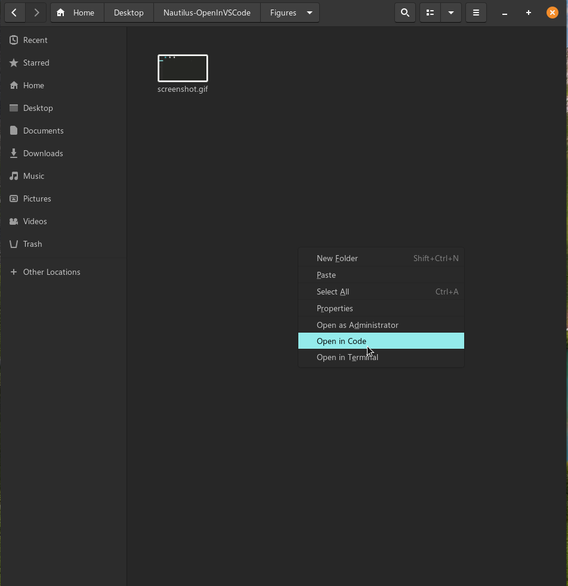
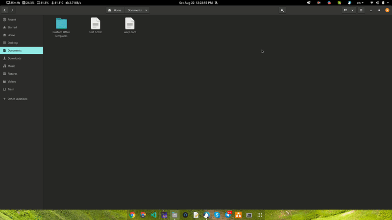

> **This is a fork of https://github.com/vvanloc/Nautilus-OpenInVSCode but modified for [VSCodium](https://vscodium.com).**

> **There is no Insiders version of VSCodium.**

# Nautilus context menu: Open in VSCodium

Dependency to install before: `nautilus-python` (`python-nautilus` package on Debian / Ubuntu)

```bash
sudo apt install python3-nautilus
```

## Note

If you install VSCodium from Snap Store, you must make symbolic links to `/usr/bin/codium`

```sh
sudo ln -s /snap/bin/codium /usr/bin/codium
```

or

```sh
sudo ln -s $(which codium) /usr/bin/codium
```

## Install

- VSCodium:
  ```sh
  ./install.sh
  or
  sudo ./install.sh
  ```
<!-- - VSCodium Insiders:
  ```sh
  ./install-insiders.sh
  or
  sudo ./install-insiders.sh
  ``` -->

## Uninstall

- Current User:
  ```sh
  rm ~/.local/share/nautilus-python/extensions/vscodium-nautilus.py
  ```
  <!-- or
  rm ~/.local/share/nautilus-python/extensions/vscodiuminsiders-nautilus.py -->
- All User:
  ```sh
  sudo rm /usr/share/nautilus-python/extensions/vscodium-nautilus.py
  ```
  <!-- or
  sudo rm /usr/share/nautilus-python/extensions/vscodiuminsiders-nautilus.py -->

### Restart Nautilus

```bash
nautilus -q
```

# Screenshot



